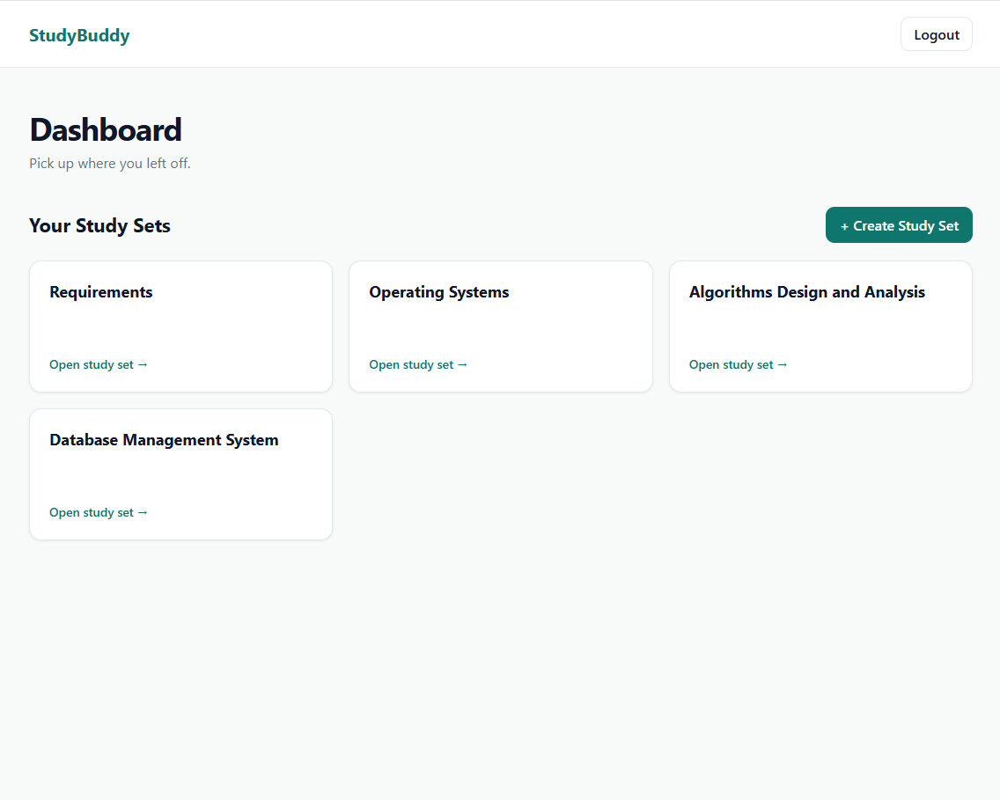
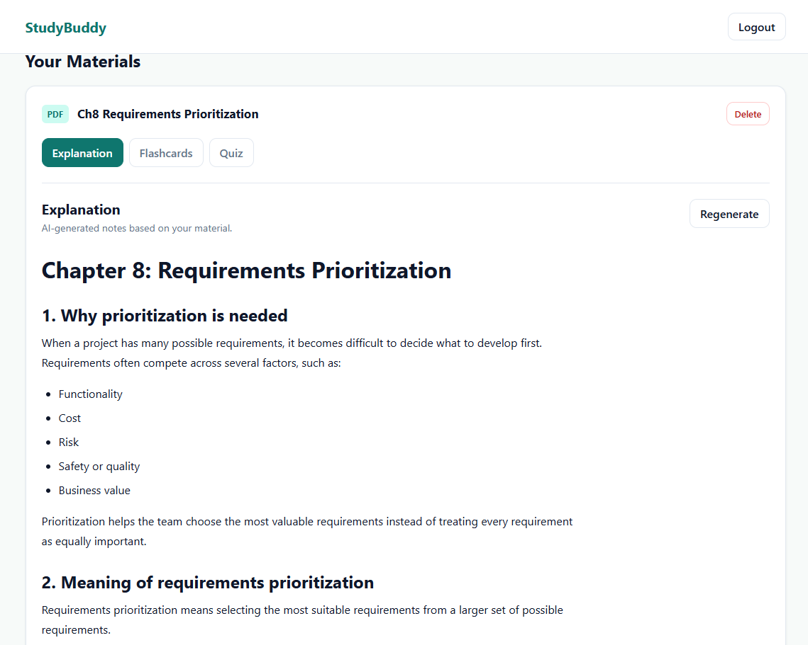
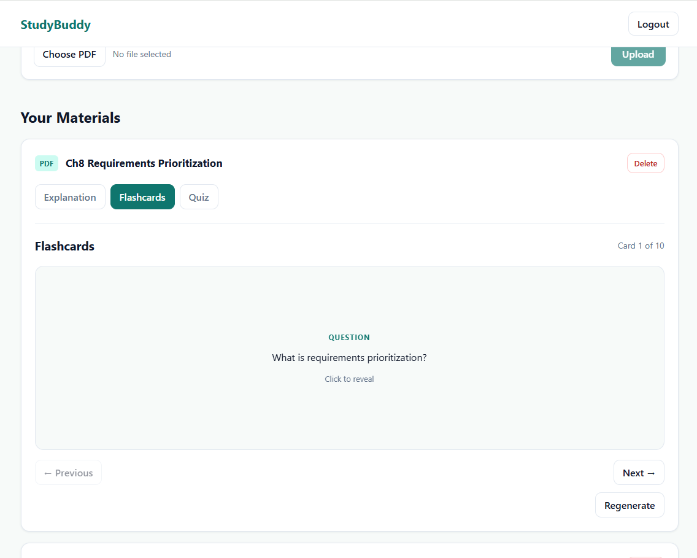
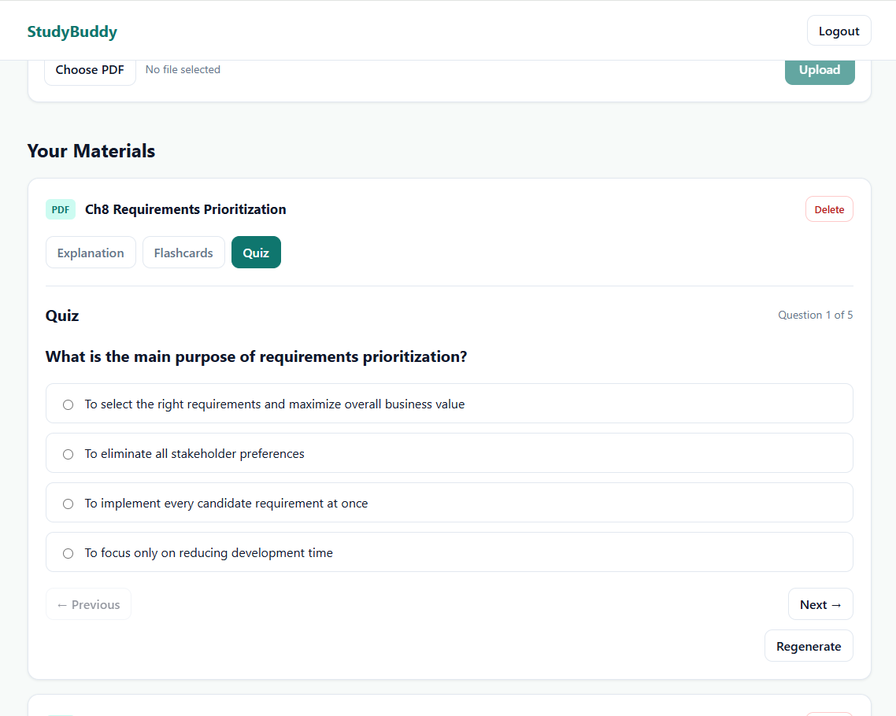

# StudyBuddy

StudyBuddy is an AI-powered study companion built to make exam preparation simpler and more efficient. Users upload the PDF material they need to study, and StudyBuddy turns it into:

- Clear explanations
- Flashcards
- Quizzes

## Live Demo

[Open StudyBuddy](https://studybuddy-beta-neon.vercel.app)
> **Note:** The backend is hosted on Render's free tier, so the first request may take a little longer while the server wakes up.

## Features

- User authentication with email verification
- Create and manage study sets
- Upload PDF study materials
- Automatically extract text from uploaded PDFs
- Generate simplified AI explanations
- Generate flashcards from study material
- Generate multiple-choice quizzes
- Regenerate explanations, flashcards, and quizzes
- Save generated study content for later use
- Responsive design for desktop and mobile

## Tech Stack

### Frontend
- React
- TypeScript
- Vite
- React Router
- React Markdown
- KaTeX

### Backend
- Node.js
- Express
- TypeScript
- Zod
- pdf-parse
- OpenAI API

### Database, Authentication & Storage
- Supabase Database
- Supabase Auth
- Supabase Storage
- Row Level Security (RLS)

### Deployment
- Vercel — frontend
- Render — backend

## Architecture

StudyBuddy follows a client-server architecture:

```text
React + TypeScript Frontend
        |
        v
Express + TypeScript Backend
        |
        +------------------+
        |                  |
        v                  v
    Supabase            OpenAI API
    - Auth
    - Database
    - Storage
```

The frontend handles the user interface and communicates with the Express backend for server-side operations. The backend processes uploaded PDFs and securely communicates with OpenAI, while Supabase handles authentication, database storage, and file storage.

## How It Works

1. The user creates an account or logs in.
2. The user creates a study set.
3. A PDF study material is uploaded to Supabase Storage.
4. The backend extracts text from the PDF.
5. The extracted text is stored and used as input for AI generation.
6. The user can generate:
   - Explanations
   - Flashcards
   - Quizzes
7. Generated content is saved to the database so it can be revisited later.

## Screenshots

### Landing Page


### Dashboard


### Explanation


### Flashcards


### Quiz


## Running Locally

### 1. Clone the repository

```bash
git clone https://github.com/Salman12-1/studybuddy.git
cd studybuddy
```

### 2. Install frontend dependencies

```bash
npm install
```

### 3. Install backend dependencies

```bash
cd backend
npm install
```

### 4. Configure environment variables

Create a `.env.local` file in the project root:

```env
VITE_SUPABASE_URL=your_supabase_url
VITE_SUPABASE_PUBLISHABLE_KEY=your_supabase_publishable_key
VITE_API_URL=http://localhost:3000
```

Create a `.env` file inside the `backend` folder:

```env
SUPABASE_URL=your_supabase_url
SUPABASE_PUBLISHABLE_KEY=your_supabase_publishable_key
OPENAI_API_KEY=your_openai_api_key
FRONTEND_URL=http://localhost:5173
```

Do not commit these files or expose your API keys publicly.

### 5. Start the backend

From the `backend` folder:

```bash
npm run dev
```

The backend will run locally on port `3000`.

### 6. Start the frontend

Open another terminal from the project root and run:

```bash
npm run dev
```

The frontend will be available at:

```text
http://localhost:5173
```

## Future Improvements

Possible future improvements include:

- Custom flashcard generation counts
- Custom quiz question counts
- Difficulty levels for generated content
- Additional study modes
- Performance improvements and code splitting
